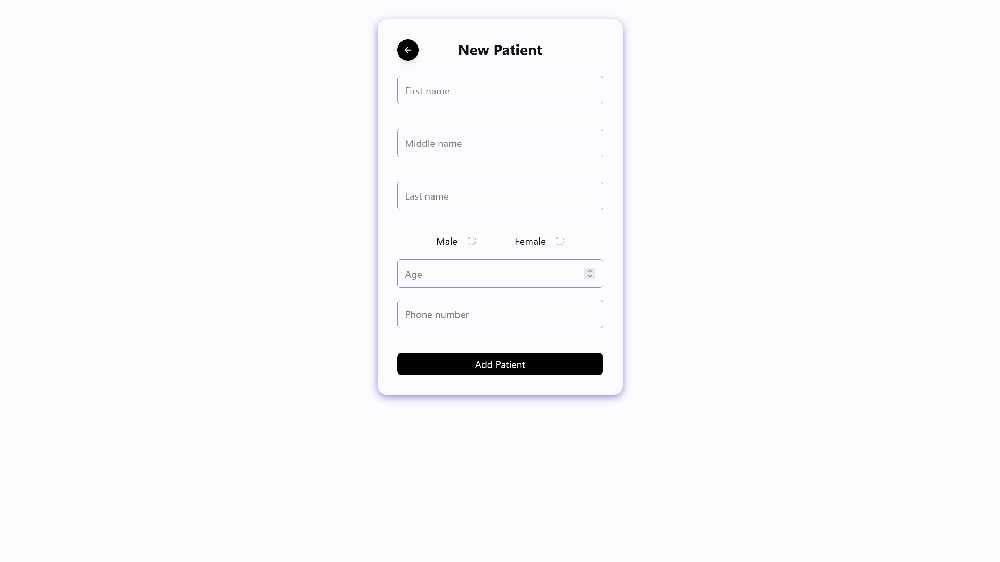
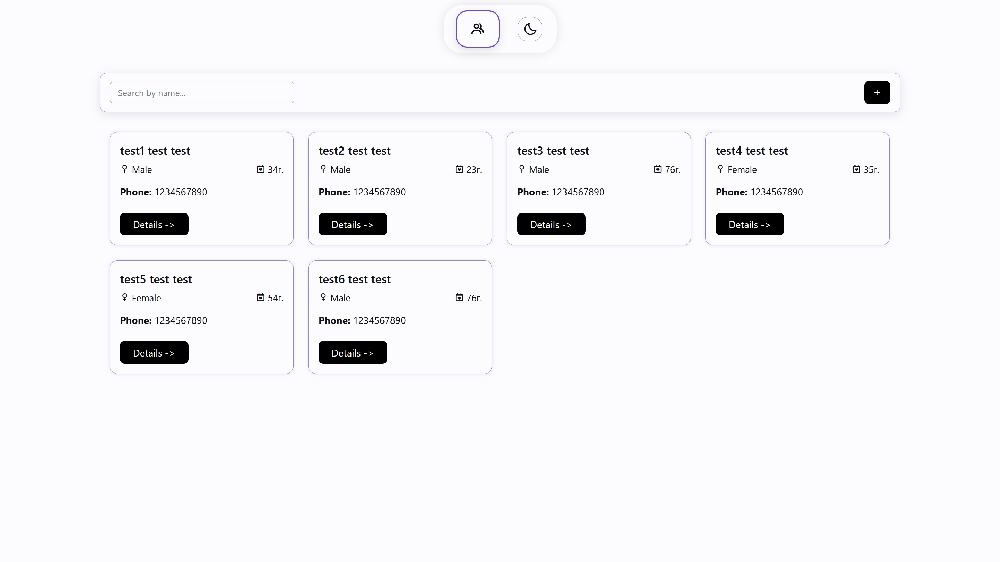
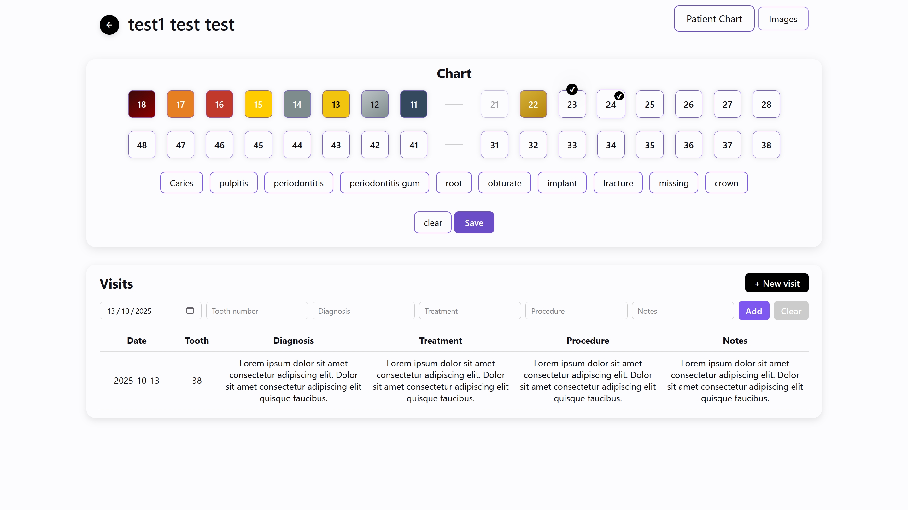

# 🦷 Dental Management System

Web application for managing patient records, dental charts, visitations.  
<i> <b>!Warning!</b> Keep in mind that the live demo is made with a static HTML including the very basic functionality needed. There will be differences between the actual project and the static version.</i>

---

## 🔧 Tech Stack Used

- PHP
- MySQL
- HTML & CSS
- JavaScript
- Boxicons (for icons)

---

## 💻 Hosting

This project runs on a local server environment such as **XAMPP**.

### What is XAMPP?

XAMPP is a free and open-source cross-platform web server solution stack package that includes **Apache**, **MySQL**, **PHP**, and **Perl**. It allows you to run PHP applications on your computer without needing an external server.

### How to Set Up XAMPP

1. Download and install XAMPP from [https://www.apachefriends.org/](https://www.apachefriends.org/)
2. Open the **XAMPP Control Panel** and start **Apache** and **MySQL** modules.
3. Copy the project folder into the `htdocs` directory (usually found in `C:\xampp\htdocs\`).
4. Open your browser and navigate to `http://localhost/<project-folder>/` to view the app.
5. Import the provided `database.sql` file into **phpMyAdmin** to create the required tables.
6. Update the `config.php` file with your local database credentials.

---

## 🚀 Features

- ✅ Add, edit, and view patient details
- ✅ Dental chart with selectable (more common) conditions for each tooth
- ✅ Record patient visitations
- ✅ View Patient's x-ray images
- ✅ Theme switching (light/dark) 🌞🌙
- ✅ Responsive UI

---

## 📸 Preview images

**Add New Patient**

**Patient List**

**Patient Details & Tooth Chart**

---
